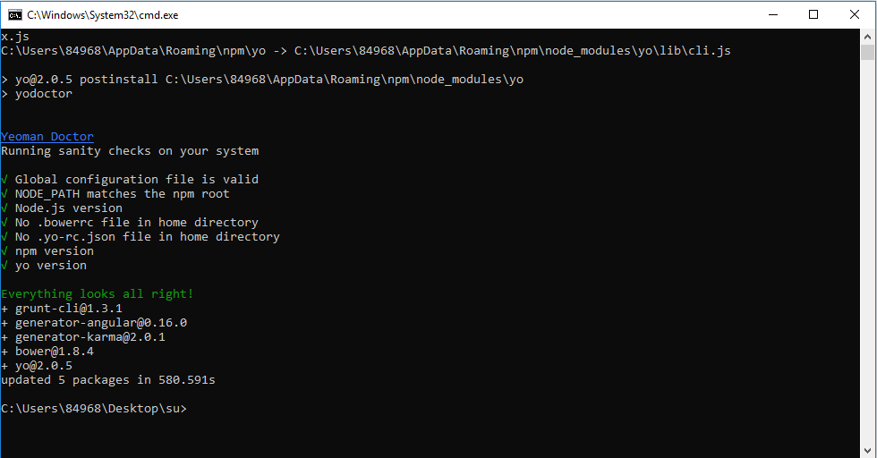
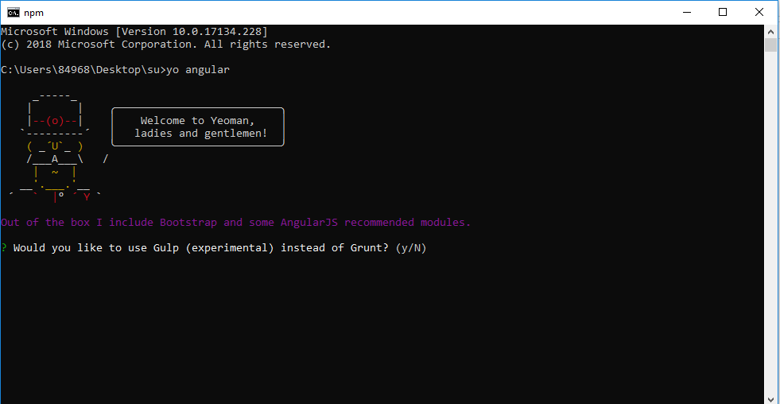
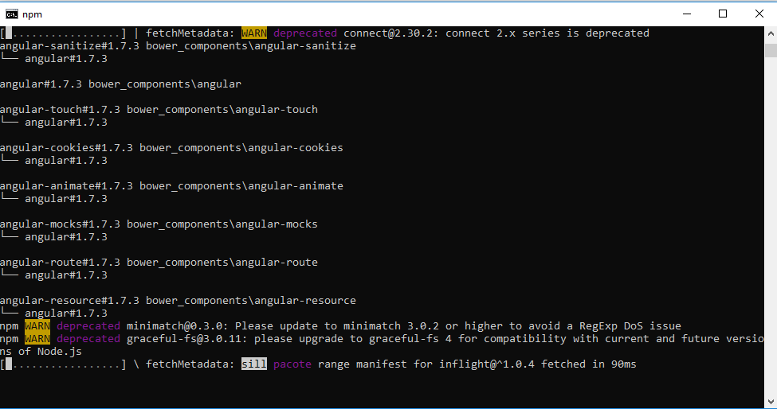
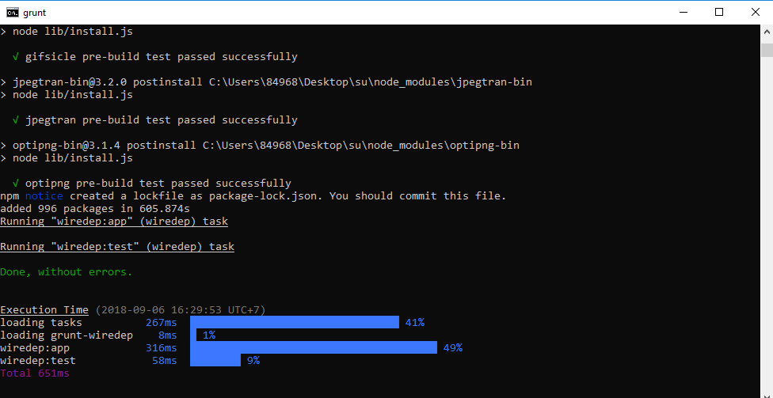
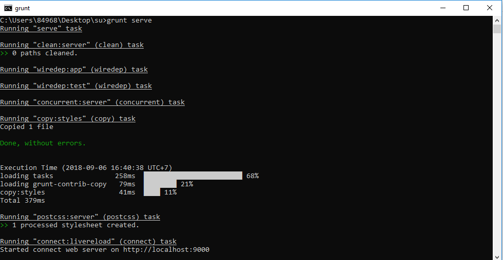
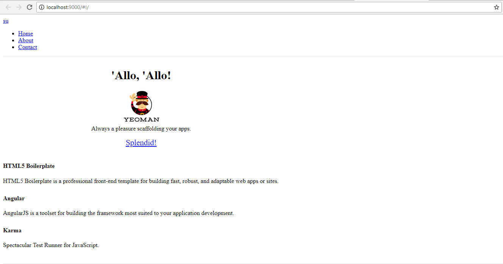

# LẬP TRÌNH  FRONT-END

# AngularJS

### I. NỘI DUNG TÌM HIỂU

#### 1.  AngularJS là gì?

 AngularJS là một framework có cấu trúc cho các ứng dụng web động. Nó cho phép bạn sử dụng HTML như là ngôn ngữ mẫu và cho phép bạn mở rộng cú pháp của HTML để diễn đạt các thành phần ứng dụng của bạn một cách rõ ràng và súc tích. Hai tính năng cốt lõi: Data binding và Dependency injection của AngularJS loại bỏ phần lớn code mà bạn thường phải viết. Nó xảy ra trong tất cả các trình duyệt, làm cho nó trở thành đối tác lý tưởng của bất kỳ công nghệ Server nào.

#### 2. Đặc trưng của AngularJS

 - Phát triển dựa trên Javascript
 - Tạo các ứng dụng client-side theo mô hình MVC.
 - Khả năng tương thích cao, tự động xử lý mã javascript để phù hợp với mỗi trình duyệt.
 - Mã nguồn mở, miễn phí hoàn toàn và được sử dụng rộng rãi.

#### 3. Các tính năng cơ bản
  
- `$scope`  là đối tượng có nhiệm vụ giao tiếp giữa controller và view của ứng dụng.

Cách dùng
```javascript
<div ng-app="myApp" ng-controller="myCtrl">

<input ng-model="name">

<h1>My name is {{name}}</h1>

</div>

<script>
var app = angular.module('myApp', []);

app.controller('myCtrl', function($scope) {
    $scope.name = "John Doe";
});
</script>
```
- `Controller`  xử lí dữ liệu cho đối tượng **$scope**, từ đây bên views sẽ sử dụng các dữ liệu trong scope để hiển thị ra tương ứng.

Cách dùng
```javascript
<div ng-app="myApp" ng-controller="myCtrl">

First Name: <input type="text" ng-model="firstName"><br>
Last Name: <input type="text" ng-model="lastName"><br>
<br>
Full Name: {{firstName + " " + lastName}}

</div>

<script>
var app = angular.module('myApp', []);
app.controller('myCtrl', function($scope) {
    $scope.firstName = "John";
    $scope.lastName = "Doe";
});
</script>
```
- `Data-binding`  tự động đồng bộ dữ liệu giữa model và view

Cách dùng
```javascript
var app = angular.module('myApp', []);
app.controller('myCtrl', function($scope) {
    $scope.firstname = "John";
    $scope.lastname = "Doe";
});
```
- `Data-binding`  tự động đồng bộ dữ liệu giữa model và view

Cách dùng
```javascript
var app = angular.module('myApp', []);
app.controller('myCtrl', function($scope) {
    $scope.firstname = "John";
    $scope.lastname = "Doe";
});
```
- `ng-click`  sự kiện xảy ra khi click chuột

Cách dùng
```javascript
<html>
<script src="https://ajax.googleapis.com/ajax/libs/angularjs/1.6.9/angular.min.js"></script>
<body ng-app="">

<p>Click the button:</p>

<button ng-click="count = count + 1" ng-init="count=0">OK</button>

<p>The button has been clicked {{count}} times.</p>

</body>
</html>
```

- `ng-chage`  thay đổi theo sự kiện mà người dùng chọn.

Cách dùng
```javascript
<html>
<script src="https://ajax.googleapis.com/ajax/libs/angularjs/1.6.9/angular.min.js"></script>
<body ng-app="myApp">
<div ng-controller="myCtrl">
  <p>Write something in the input field:</p>
  <input type="text" ng-change="myFunc()" ng-model="myValue" />
  <p>The input field has changed {{count}} times.</p>
</div>

<script>
  angular.module('myApp', [])
    .controller('myCtrl', ['$scope', function($scope) {
      $scope.count = 0;
      $scope.myFunc = function() {
        $scope.count++;
      };
    }]);
</script>
</body>
</html>
```

- `ng-style`  css cho thẻ được chọn mà không cần phải viết vào location write CSS

Cách dùng
```javascript
<html>
<script src="https://ajax.googleapis.com/ajax/libs/angularjs/1.6.9/angular.min.js"></script>

<body ng-app="myApp" ng-controller="myCtrl">

<h1 ng-style="myObj">Welcome</h1>

<script>
var app = angular.module("myApp", []);
app.controller("myCtrl", function($scope) {
  $scope.myObj = {
    "color" : "white",
    "background-color" : "coral",
    "font-size" : "60px",
    "padding" : "50px"
  }
});
</script>

</body>
</html>
```

- `Filter`  Lọc các tập con từ tập item trong các mảng và trả về các mảng mới.

Cách dùng
```javascript
<!DOCTYPE html>
<html>
<script src="https://ajax.googleapis.com/ajax/libs/angularjs/1.6.9/angular.min.js"></script>
<body>

<div ng-app="myApp" ng-controller="namesCtrl">

<ul>
  <li ng-repeat="x in names | filter : 'i'">
    {{ x }}
  </li>
</ul>

</div>

<script>
angular.module('myApp', []).controller('namesCtrl', function($scope) {
    $scope.names = [
        'Jani',
        'Carl',
        'Margareth',
        'Hege',
        'Joe',
        'Gustav',
        'Birgit',
        'Mary',
        'Kai'
    ];
});
</script>

<p>This example displays only the names containing the letter "i".</p>

</body>
</html>
```
- `Directive`  dùng để tạo các thẻ HTML riêng phục vụ những mục đích riêng. AngularJS có những directive có sẵn như **ngBind**, **ngModel**…

Cách dùng
```javascript
<html>
<script src="https://ajax.googleapis.com/ajax/libs/angularjs/1.6.9/angular.min.js"></script>
<body>

<div ng-app="" ng-init="quantity=1;price=5">

<h2>Cost Calculator</h2>

Quantity: <input type="number" ng-model="quantity">
Price: <input type="number" ng-model="price">

<p><b>Total in dollar:</b> {{quantity * price}}</p>

</div>

</body>
</html>
```
- `Routing`  chuyển đổi giữa các action trong controller, qua lại giữa các view.

Cách dùng
```javascript
<html>
<script src="https://ajax.googleapis.com/ajax/libs/angularjs/1.6.9/angular.min.js"></script>
<script src="https://ajax.googleapis.com/ajax/libs/angularjs/1.6.9/angular-route.js"></script>

<body ng-app="myApp">

<p><a href="#/!">Main</a></p>

<a href="#!red">Red</a>
<a href="#!green">Green</a>
<a href="#!blue">Blue</a>

<div ng-view></div>

<script>
var app = angular.module("myApp", ["ngRoute"]);
app.config(function($routeProvider) {
    $routeProvider
    .when("/", {
        templateUrl : "main.htm"
    })
    .when("/red", {
        templateUrl : "red.htm"
    })
    .when("/green", {
        templateUrl : "green.htm"
    })
    .when("/blue", {
        templateUrl : "blue.htm"
    });
});
</script>
    <p>Click on the "red.htm", "green.htm", "blue.htm"</p>
</body>
</html>
```
- `MVC` : mô hình thiết kế để phân chia các ứng dụng thành nhiều phần khác nhau (gọi là Model, View và Controller) mỗi phần có một nhiệm vụ nhất định. AngularJS không triển khai MVC theo cách truyền thống, mà gắn liền hơn với Model-View-ViewModel.

#### 4.Các components chính
 - **ng-app** : định nghĩa và liên kết một ứng dụng AngularJS tới HTML.
 - **ng-model** : gắn kết giá trị của dữ liệu ứng dụng AngularJS đến các điều khiển đầu vào HTML.
 - **ng-bind** : gắn kết dữ liệu ứng dụng AngularJS đến các thẻ HTML.
#### 5. Ưu điểm của angularJS
Cung cấp khả năng tạo ra các Single Page Aplication dễ dàng.
Cung cấp khả năng data binding tới HTML, khiến cho người dùng cảm giác linh hoạt, thân thiện.
Dễ dàng Unit test
Dễ dàng tái sử dụng các thành phần (Component)
Giúp lập trình viên viết code ít hơn với nhiều chức năng hơn.
Chạy được trên các loại trình duyệt, trên cả PC lẫn mobile.
#### 6. Nhược điểm
Không an toàn : được phát triển từ javascript cho nên ứng dụng được viết bởi AngularJS không an toàn. Nên có sự bảo mật và xác thực phía server sẽ giúp ứng dụng trở nên an toàn hơn.
Nếu người sử dụng ứng dụng của vô hiệu hóa JavaScript thì sẽ chỉ nhìn thấy trang cơ bản.
Phần giới thiệu về Angular JS của mình đến đây là kết thúc. Ở phần tiếp theo mình sẽ nói về Directive trong AngularJS.

### II. Sử dụng AngularJS bằng tool
Cách cài đặt như sau:
 - Bước 1: Tạo 1 folder bất kỳ ngoài màn hình desktop.
 - Bước 2: Mở folder vừa mới tạo, và chạy lệnh cmd.
 - Bước 3: Cài đặt yeoman angularjs băng lệnh sau: 
    **npm install -g grunt-cli bower yo generator-karma generator-angular**

    - Chạy:
    
    
    - Kết quả:

    

 - Bước 4: chạy lệnh **yo angular** để tải thư viện yo angular về folder của mình.

 

  - Bước 5: Để cài nhanh ko cài  Sass,Bootstrap,.. nhấn **n** và **enter** và hết lựa chon y/n ... nhấn enter 

      - Quá trình cài đặt bắt đầu:

      

      - Thành công:

      
 
- Bước 6: Để chạy thử trên IDE... bật cửa sổ cmd từ folder vừa tạo ...gõ lệnh **grunt serve**
    - Kết quả:

    
    
    - IDE Display: 

    

- Bước 7: Gỡ cài đặt: gõ lệnh **npm uninstall -g [generator-name]** vào cmd của folder đó.

### III. Sử dụng AngularJS thủ công:

Tạo project như bình thường và thêm 
```javascript 
<script src="http://ajax.googleapis.com/ajax/libs/angularjs/1.3.14/angular.min.js"></script>
```
 vào cặp thẻ 
 ```javascript 
 <head></head>
 ```
 và sử dụng syntax của AngularJS như bình thường.

### IV.	YÊU CẦU

Tự tìm hiểu về AngularJS và viết báo cáo những nội dung có liên quan

### V.	NỘP BÀI

- doc: Báo Cáo (README.md).
- Tạo Project trên Github và gửi Link cho người hướng dẫn:
